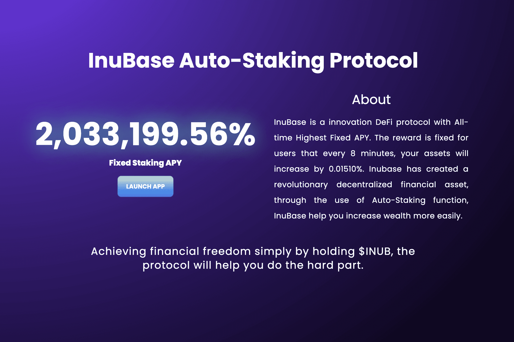

# Inu Base

犬洲基地|DeFi 3.0为$INUB令牌自动质押和自动复利功能，市场上最高的固定APY之一2，033，199.56%与Move-to-Earn应用程序相结合，使其完美

Inu Base的价格在过去7天内下跌了15.76%。价格在过去24小时内下降了3.13%。在过去的一个小时内，价格上涨了0.00%。当前价格为每 INUB 0.077133 美元。Inu Base比4.405637美元的历史高点低98.25%。

当前循环供应量为 0 INUB。

Inu Base Auto-Staking 功能是一个简单而前沿的功能，称为 Buy-Hold-Earn，它为 $INUB 持有者提供了终极易用性。 Buy-Hold-Earn – 只需在钱包中购买并持有 $INUB 代币，您就可以获得 rebase 奖励，作为直接存入钱包的利息。 您的代币将每 8 分钟增加一次。 使用 Positive Rebase 公式，Inu Base 使得代币分配的支付与 epoch rebase 奖励成正比成为可能，每 8 分钟 epoch 周期价值 0.01510%，占您钱包中持有的 $INUB 代币总量的 0.01510%。 rebase 奖励在每个 EPOCH（8 分钟 rebase 周期）分配给所有 $INUB 持有者。 这意味着，在不从钱包中转移代币的情况下，$INUB 持有者第一年的年复利为 2,033,199.56%。

