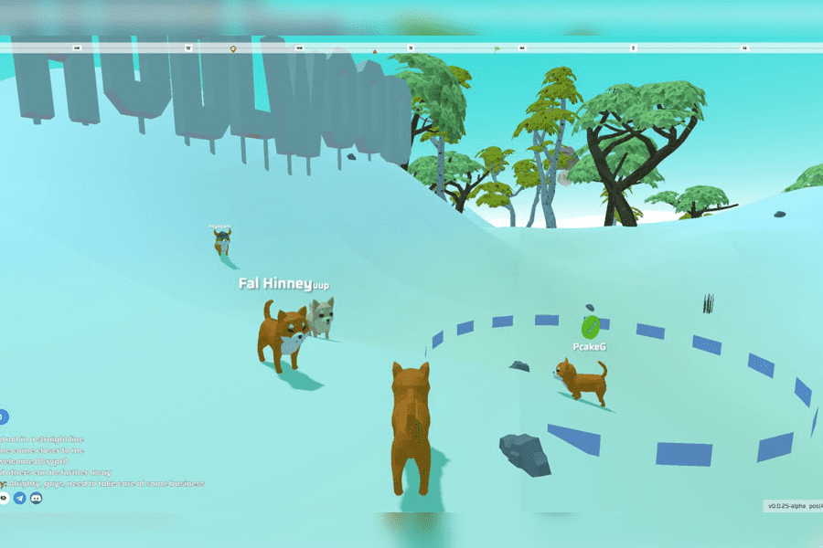

# Inugami World

Inugami World 是一款开放世界概念、免费玩、玩即赚 NFT 游戏，允许玩家竞争 $GAMI 奖励和 XP 积分。角色基于众所周知的模因和电影角色，使其成为同类游戏中的第一款游戏。玩家探索广阔的 Inuverse，收集更强大的角色，以获得与其他人相比获得奖励的更多机会。通过神秘盒子获得的角色可以在公开市场上出售以获取利润。我们邀请您在我们独特且奖励丰厚的界面中成为 Inuverse 的主人，并为顶级狗的地位而战。
游戏从初始生成区域开始，玩家按照教程学习游戏的基础知识。这包括步行、跑步、跳跃、挖掘、撒尿，以及一些小任务来掌握游戏玩法。完成初始任务后，玩家将被释放到开放世界中进行探索、参加迷你游戏并与其他玩家互动。奖励可以在指定随机区域的开放世界中找到，但主要是在迷你游戏中获得。
耐力和能量在游戏中起着关键作用，因为每个角色都有自己的耐力统计数据。玩家必须根据所使用角色的耐力统计数据不断补充能量。角色的耐力越多，它可以冲刺的时间越长而无需加油。玩家可以通过从最近的麦当劳购买汉堡包或步行并自然获得能量来补充能量，这可能需要很长时间。如果一个角色有 30 分钟的冲刺耐力，则需要 60 分钟的步行才能将其能量从 0% 补充到 100%。

到 100%。
