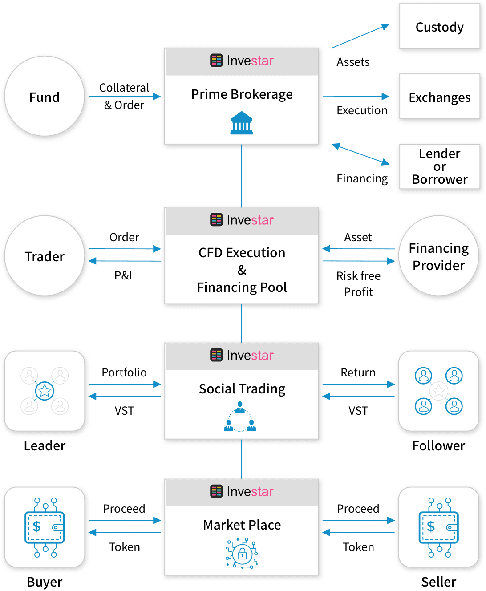

# Investar

Investar 是一个基于区块链的投资和交易服务平台，每个投资者都可以通过我们先进的交易解决方案交易加密货币和各种资产。我们提供最好的集中式和分散式创新交易解决方案，例如差价合约  （差价合约）访问、W2W（钱包到钱包）交易，以及暗池订单下的直接订单匹配算法最大的交易效率和便利性。对于需要综合基金服务的机构投资者，我们提供自动化的一站式大宗经纪服务，包括保证金交易、资产融资、多头/空头准入、托管服务以及其他便于投资组合管理的运营和行政服务。我们还提供社交交易功能，用户可以通过积极交易和使用我们的产品和服务以及参与投资相关活动（如投资联盟、调查、内容共享和各种平台内活动，所有这些都归因于平台及其用户。所有这些贡献都将通过 Investar 代币得到公平补偿，VST 将根据大量用户活动产生的定性和定量数据有机地创造其价值。 Investar 旨在连接每一位投资者，在未使用的资产中发现价值，捕捉每一点有价值的数据，并建立强大可靠的投资社区，所有这些最终都将使 Investar 生态系统内的所有用户受益。我们先进的交易解决方案和复杂的算法将最大限度地提高交易效率，最大限度地减少不必要的交易成本浪费，降低交易所平台的潜在风险，并引导我们的用户成功投资。

