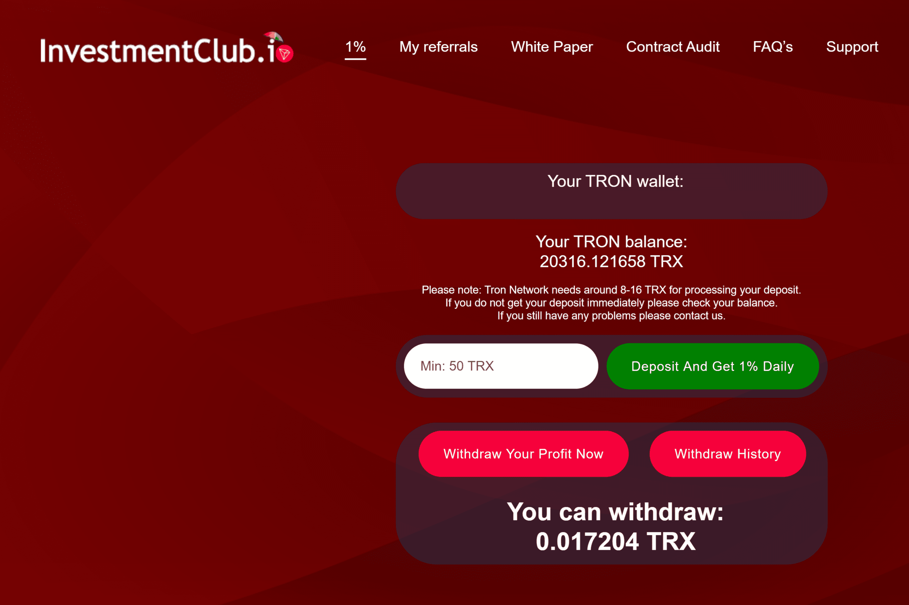

# Investment Club IO

这个怎么运作
Investment Club 智能合约旨在为每个人提供一个
基于 Tron Blockchain Smart 的独立财务支持基金
合约技术。
任何参与者都可以向社区基金贡献 TRX(tron) 和
支持投资俱乐部社区成员，并将立即
开始从其他社区成员那里获得支持。
Investment Club 是 100% 去中心化的社区项目；
意思是，社区本身使可再生的微观经济
生态系统，有可能在数年内继续产生资金。
1%
这是我们为投资者社区提供的第一个项目。它
是每日 1% 收益率的中期合约，总回报率为 200%。
-1% 每日股息
-10 % 推荐计划
-200 天支付
-开源合约
- 在 tron 扫描中验证
-第三方审计报告
推荐计划
投资者可以创建自己的投资俱乐部成员团体，
邀请他们加入投资俱乐部平台。通过这样做，投资者将
得到：
- 5% 的朋友存款
- 朋友每次提款的 5%。
制作投资俱乐部平台，几乎玩到赢。
*注：生成推荐链接需要最低投资50 TRX。
由人民为人民制造
- 
