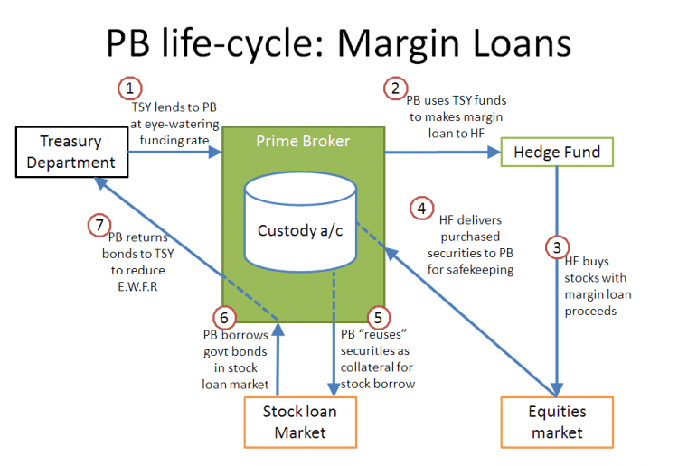

# Invictus Margin Lending

保证金借贷基金旨在以零预期提款风险最大化美元和美元等价物的利息收入。 基金资产将在保证金借贷平台上有效借出，并面临取决于市场需求的波动收益率。 从历史上看，回报率明显高于传统市场中可比较的基于美元的货币市场工具。 因此，本基金旨在为投资者提供高度的资本稳定性以及在其投资期限内的持续回报。 本基金适合相对规避风险并寻求能够提供资本保值和持续回报的投资工具的投资者。

