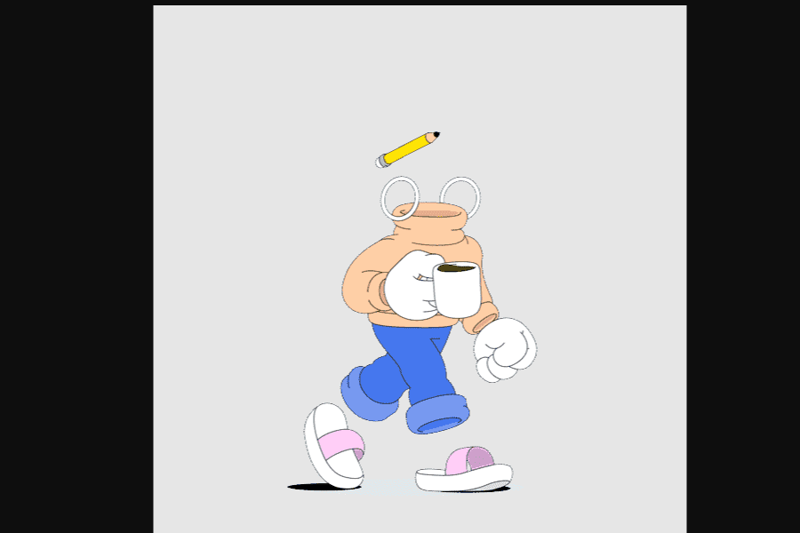

# Invisible Friends

隐藏在元宇宙中。
Invisible Friends 是由 Markus Magnusson 创作的 5000 个动画隐形角色的集合。
隐形朋友是一个随机角色集体项目。

什么，谁，在哪里？ KITH 隐形朋友，真的吗？ 那是什么？ 五月你就知道了。 持有人的优先访问权。

在夏季结束时，所有 IF 持有者将有机会铸造一个由 Nguyen Nhut 制作的具有新旧随机特征的 3D 隐形朋友。 请继续关注有关发布的更多信息。

玩具，玩具，玩具！！！ 谁不喜欢玩具！？ 不可能是我们！ 这就是为什么我们将我们的 OG Friend 带入现实世界，并让我们的 3D 持有者有机会为他们的收藏抓住这个未来的经典之作。 它会涉及自己的 NFT 吗？ HODL 并找出答案！

