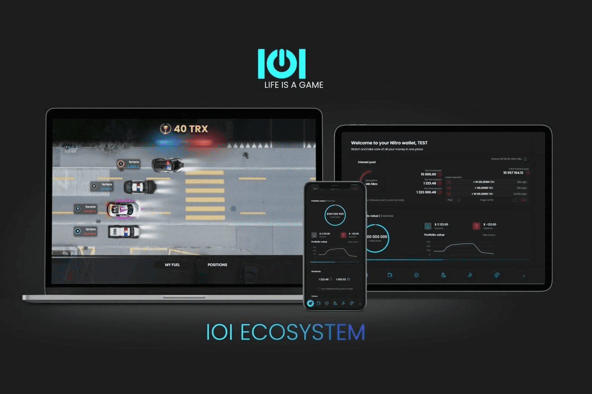

# IOI-game

将有限的汽车作为 NFT 进行质押 - 玩家对玩家的游戏 - 10,000 TRX 保证奖池 - 即时奖励的冒险和锦标赛 - IOI 代币持有者的奖励池 - 为交易者和投资者提供的强大 NITRO 钱包 - 将您的加密资产保存在安全的地方并受到完全控制 - 交易池高达 36% APY - 持有 IOI 代币 - 接收交易信号。
玩游戏，质押 IOI 代币，并通过 IOI 获得终身奖励。

IOI 游戏标志
网站
门启动板
付费点火
道制造者启动板
IOI游戏
ICOIEOIDOL最后更新日期：2021 年 7 月 16 日
Gate Launchpad上的IOI游戏付费Ignition上的IOI游戏Daomaker Launchpad上的IOI游戏
游戏玩家和交易者排名第一的生态系统。由 Defi 和 NFT 提供支持，为您赢得终身奖励。

重要提示：投资此业务即表示您同意我们的免责声明。包括我们的评级在内的所有信息仅供参考。 CryptoTotem 不提供投资建议。

概述
项目行业游戏和虚拟现实
产品类型生态系统
成立斯洛伐克（斯洛伐克共和国）
IOI游戏白皮书白皮书
图表
1小时 24小时 7天 14天 30天 1年
-0.6% -15.4% -5.7% 3.8% -13.5% -90.8%
价格市值24h7d14d30d60d90d180d365dMax
EURBTCETH
什么是IOI游戏
IOI 是由 Defi 和 NFT 提供支持的游戏玩家和交易者排名第一的生态系统，可为您赢得终生奖励。该平台专注于不断发展的 play2earn 模式，并为 PvP 游戏创建了新标准。

根据 DappRadar IOI 是每日用户在 Tron 区块链上推荐的 Nr.1 游戏。此外，根据 DappStats，IOI 被评为 2020 年 Nr.1 区块链游戏。用户可以享受加密交易与区块链游戏的独特组合。游戏的核心是用于赛车的可收藏 NFT 汽车。玩家选择虚拟加密投资组合作为燃料。性能数据直接从交易所提供。具有最佳表现组合的玩家，用作汽车燃料赢得比赛。

IOI 是一款基于 TRON 和 Matic 网络的多区块链游戏。它提供了以太坊的L2解决方案，具有更低的费用和更高的可扩展性。我们一直在谈判其他战略伙伴关系，这些伙伴关系很快就会成为现实。 IOI 生态系统拥有通货紧缩的多用途代币和自己的多链数字 Nitro 钱包。

