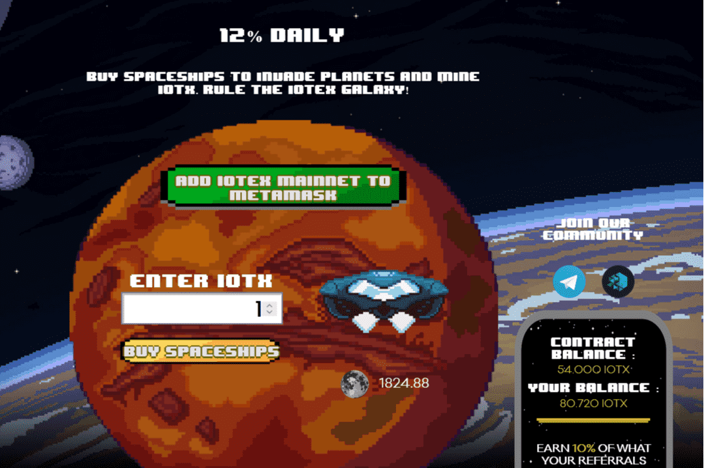

# IoTeX Galaxy

IoTeX Galaxy 是 IoTeX 链上的一款挖矿游戏。 您可以购买将入侵行星的宇宙飞船为您无限期地开采 IOTX，初始每日回报率为 12%。
游戏的原则是通过让您的舰队在适当的时间购买宇宙飞船（价格不同）来保持您的回报，以便能够收回您的资金并赚取利润（通过在您想要的时候退出 ）。

项目的可持续性

不像它的前辈每天支付 100%，导致即时和巨大的通货膨胀。 IoTeX Galaxy 每天支付 12% 的适度费用，让投资者高枕无忧，因为他们知道他们的投资具有无限的增长潜力和低于 12% 的最大、不可能的风险。
已验证的公共合同

IoTeX Galaxy 合约是公开的、经过验证的，可以在 IoTeX 区块浏览器上查看。
采矿星球信息

矿机按目前的挖矿效率每天支付12%。 当您和其他玩家雇佣矿工、复合收益和口袋 IOTX 时，采矿效率会上升和下降。

游戏的目标是比其他玩家更快、更频繁地雇佣更多的矿工。 这反过来又可以让您更快地获得更多的 IOTX。 使用您的每日 IOTX 收入雇用更多矿工将在 30 天或更短的时间内将您的矿工增加 10 倍。

