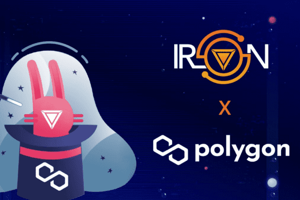

# Iron Finance

IRON FINANCE 构建多链部分抵押的 DeFi 和算法稳定币生态系统
Iron Finance 正在 Polygon 网络上构建一整套产品和用例的去中心化金融生态系统。
Iron Finance 的官方代币是 ICE 代币，灵感来自冰与火之歌小说，其中铁王座是众所周知的象征。

加密世界最近充斥着负面事件。最近的一次是 6 月 16 日发生的 Iron Finance 银行挤兑。Iron Finance 是一种多链、部分抵押的稳定币协议，其主要目标是提供用于 DeFi 应用程序的与美元挂钩的稳定币。这是加密货币市场上第一次大规模的银行挤兑。

Iron Finance 的稳定币 IRON 是一种与美元挂钩的部分抵押代币，可在 Polygon 网络和币安智能链 (BSC) 上使用。每个网络上的两个不同代币支持代币的抵押。在 Polygon 网络上，它是 USD Coin (USDC) 和 TITAN 代币，而在 BSC 上，它由 Binance USD (BUSD) 和 STEEL 代币抵押。 Polygon 网络和 Iron Finance 都是由亿万富翁投资者 Mark Cuban 支持的协议。

TITAN 是稳定币 IRON 的内部抵押代币，它与 IRON 一起处于这家银行的最前沿。 TITAN 分配给流动性提供者 (LP)，用于在各种流动性池中进行质押。 LP 通过交易赚取利润并提供流动性，以便其他投资者可以购买 TITAN 代币。

正如库班在他关于单产农业、流动性提供和估值加密项目的博客中透露的那样，他是该协议的这些 LP 之一。他将他的 TITAN 代币抵押在 QuickSwap 交易所，在平台上提供了 TITAN/DAI 交易对。这意味着当投资者用 Dai 购买 TITAN 时，Cuban 将获得 100% 的交易利润。

