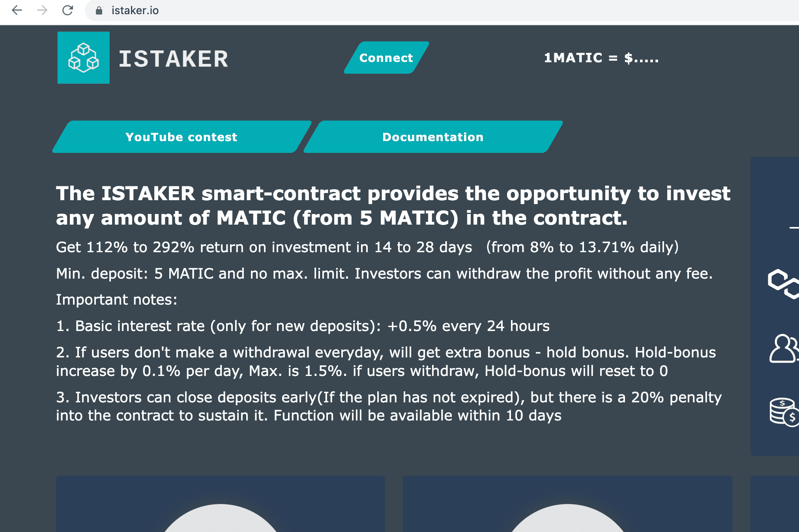

# iStaker

ISTAKER 智能合约提供了在合约中投资任意数量的 MATIC（来自 5 MATIC）的机会。
在 14 到 28 天内获得 112% 到 292% 的投资回报（每天从 8% 到 13.71%）

分钟。 押金：5 MATIC，无上限。 限制。 投资者可以免费提取利润。

重要笔记：

1. 基本利率（仅限新存款）：每24小时+0.5%

2.如果用户没有每天提款，将获得额外的奖金-持有奖金。 持有红利每天最多增加 0.1%。 为 1.5%。 如果用户退出，Hold-bonus 将重置为 0

3. 投资者可以提前关闭存款（如果计划尚未到期），但合同中有20％的罚款来维持它。 功能将在 10 内可用

计划：

1. 每天 8%，持续 14 天，总计 112%，随时

2. 每天 6.5%，持续 21 天，总计 136.5%，随时

3. 每天 5%，持续 28 天，总计 140%，随时

4. 13.7% 每天 14 天，总计 191.8%，计划结束

5. 每天 13.1%，共 21 天，总计 275%，计划结束

6. 10.4% 每天 28 天，总计 291.2%，计划结束
    最小：5 马蒂奇
    最大：无限制
    新存款的利润每天 +0.5%
    每天最高持有红利 +0.1%。 1.5%
    提前退出 4,5,6 计划，罚款 20%
    提现：无限制
    参考系统 5% - 3% - 2% 来自每笔存款

