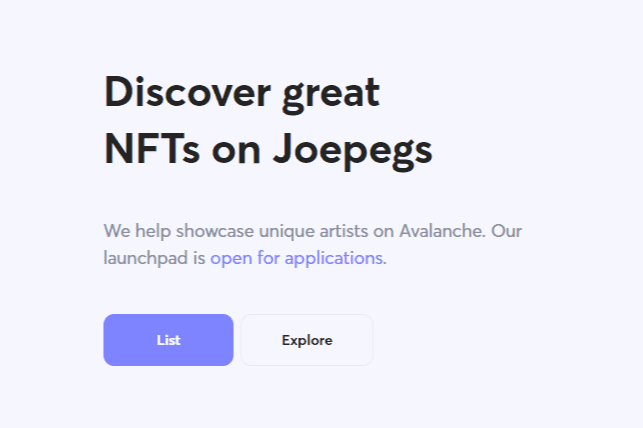

# Joepegs

Joepegs 是 Avalanche 上值得信赖的 NFT 市场。为各行各业的创作者和收藏家打造的家园，作为优质数字资产的文化中心。在 Joepegs 发现数字艺术和文化并与之互动。

- LaunchPEG：NFT Launchpad 能够支持荷兰式拍卖、升序拍卖、平板铸币厂和白名单
- 批量显示：可定制的延时批量显示功能
- 收集层：未验证、已验证和黄金层
- 艺人支持：合约创作与曝光
- 无许可：Joepegs 将索引所有兼容的 NFT 集合
- 社区：Joepegs 俱乐部和孵化器

在发布时，Joepegs 市场将提供一系列核心功能，允许用户从一开始就列出、交易和铸造 NFT。

Joepegs 市场将配备一个 NFT 启动板，能够铸造从荷兰拍卖到平板铸币厂的各种风格的收藏品。

LaunchPEG 将支持最常见的铸币方法“Flat Mints”。收藏品将以固定价格出售，并一直持续到所有 NFT 售完为止。

在 Joepegs 上发布的收藏可以选择将重要社区成员的钱包地址列入白名单，以获得独家发布特权，例如价格折扣。

NFT 项目将有能力将收集揭示延迟到他们选择的时间。此功能将在短期内支持价格底线，并有助于营造良好的发布日氛围。

