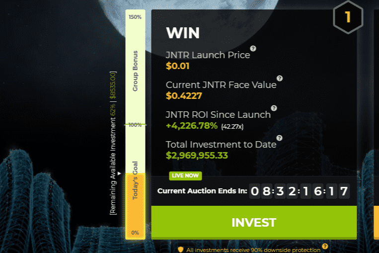

# Jointer DeFi Ecosystem

Jointer 是一个商业房地产区块链 DAO，在加利福尼亚州硅谷和以色列特拉维夫的远程团队经验总市值超过 400B 美元。 Jointer 是一家屡获殊荣的公司，其中包括 2018 年在 196 个国家/地区的 4,000 家初创公司之间的全球竞争中获得 1,000,000 美元的“世界最佳初创公司”奖，2019 年由谷歌小组获得斯坦福大学颠覆性初创公司奖，软银、贝恩资本、汤森路透、斯坦福天使、宝马、安德森、NEA等顶级风投基金，Disruptor Daily“房地产区块链”Disruptor Award第一名，美国卡内基梅隆大学最有潜力企业-中国创新创业协会。
除了 Draper Venture Network 的加入，Jointer 享有盛誉的顾问团队还包括诺贝尔奖获得者、美国证券交易委员会前主席、纳斯达克前副主席、Visa 创始人、美国国务院前首席经济学家、独联体创始人，雅虎的首席财务官，比特币原型的共同创造者和其他名人。
Jointer 利用区块链创建了一个基金联合经济基金，同时提供不相关的回报、多样化和无限的流动性。银团经济由世界上第一个正在申请专利的多层系统提供支持，该系统有助于每天提高公司的估值，同时防止价值下降，无论市场波动或任何操纵如何。这种银团经济体系可以应用于众多行业，包括保险、风险投资等。 Jointer 的第一个用例将是商业房地产。
此外，JNTR/b 是一种灵活的质押代币，每年获得 10% 的 APY

