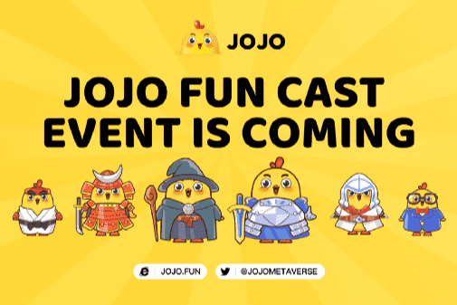

# JOJO

去中心化的 Meme 币在 BSC 上创造了最好的元宇宙
JOJO FUN METAVERSE = NFT + GameFi + SmartToy + JOJO World

JOJO魔法大战第六季今天开播🐥🐥🐥

赛季开始奖金 5,000,000 $JOJO💰

红利会随着玩家人数的增加而增加🆙

一起玩吧！😆

2021年，Meme市场出现了指数级增长，特别是以狗为主题的meme币。截至2021年11月，最受欢迎的 "品种 "之一是Dogecoin（DOGE）和其竞争对手Shiba Inu（SHIB）。

Meme是以Meme文化为基础的加密货币。与比特币（BTC）和以太坊（ETH）等主要加密货币相比，它的波动性相对来说比较高。这可能是因为Meme币是严重受社区驱动的代币。它们的价格通常受到社交媒体和在线社区情绪的影响。这往往带来很多波动，但也带来FOMO和金融风险。虽然确实有一些投资者通过Meme币发了财，但也有许多人由于市场波动或者投资一些诈骗性的代币而赔了钱。

