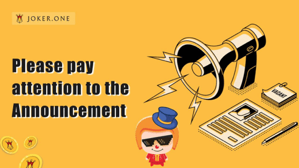

# joker.one

JOKER.ONE基于区块链技术，以去中心化匿名为设计原则，旨在在EOSIO的分布式节点上构建一个“DApp绿洲”，服务于基于EOS的游戏和金融应用。
JOKER.ONE旨在融合区块链的真实属性和价值，为全球基于EOS的生态系统构建一个集金融、游戏、服务、信息和娱乐为一体的服务体系。通过这种方式，它允许全球区块链开发商和金融参与者将他们的产出转化为利润。此外，玩家可以通过参与JOKER.ONE世界的游戏、娱乐、DeFi、挖矿等板块获得更多收益。
玩家是股东，这是 JOKER.ONE 的核心理念，即参与者应该分享平台的利润，从而共同治理平台。在此基础上，我们发行“JOKER”代币。 JOKER.ONE 生态早期的轻量级应用将在第三方平台上运行，以实现友好的用户体验，从而形成一个完整的去中心化金融和商业生态系统。终极创建去中心化共识网络，这就是 JOKER.ONE。

