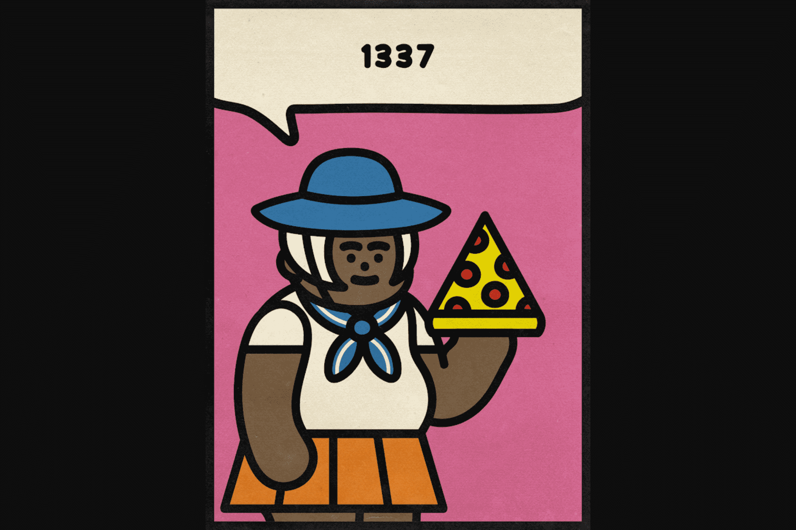

# JPG PEOPLE by Debbie Tea

JPG People 是由 Debbie Tea 创建的 8,888 个基于单词的 AI 生成 NFT 的集合。在我们的人工大脑（我们称他为 Fred）的帮助下，我们将您的信息转换为独一无二的 JPG，该 JPG 由 600 多种面部表情特征和根据您的信息及其氛围神奇地组合在一起的项目组成！

DEBBIE TEA 是一位美术摄影师，后来成为插画家，目前居住在雅加达。

她对日常物品有一种伪不健康的痴迷，并且总体上受到平凡和抽象的启发。大部分空闲时间都在睡觉或玩老式模拟游戏和 JRPGS，她对怀旧情有独钟。

黛比的方法很有趣，她喜欢她的作品充满无限可能的想法，为她的观众留下了足够的空间，让他们可以随心所欲地解释它。让他们的感知成为艺术品的一部分。

