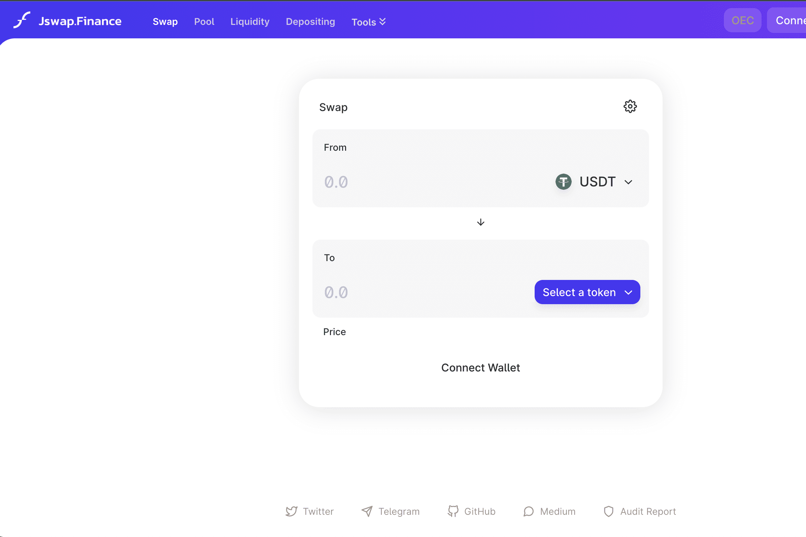

# Jswap.finance

Jswap Finance简介： ·Jswap.Finance一个去中心化的交易所和财务管理协议。治理代币JF总量为1亿。平台收益全部用于JF回购销毁。支持代币兑换、资金池、LP Farm、聚合理财、跨链桥、IDO等一系列功能，致力于为用户提供一站式DeFi服务。
基本信息： ·官网：Jswap.Finance 治理代币：JF 最大总量：1 亿 挖矿产出：100% 公链：OEC、BSC 安全审计：慢雾推特：@Jswap_Finance 电报：@Jswap_Finance 媒体：@JswapFinance
团队奖励： ·实时解锁用户挖矿产出的10%，用于团队运营、社区推广、技术开发等。
JF 发行： ·JF 的发行取决于公链的区块哈希 ·OEC 上每块当前输出：1 JF BSC 上每块当前输出：2 JF
其他： ·Jswap.Finance目前已完成两轮融资，并通过了第三方机构的安全审计。致力于打造最安全、最流畅的使用体验。

