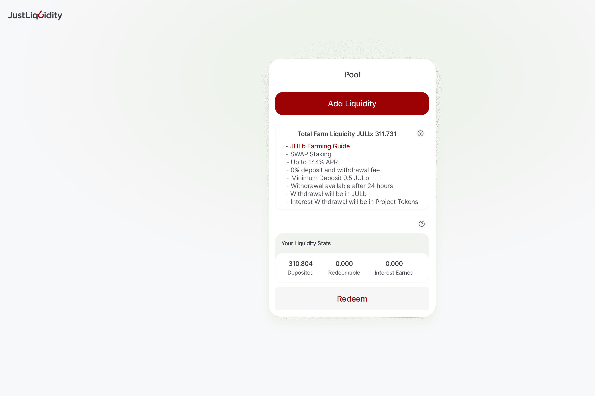

# Jul BNB Farming

JustLiuidity 是一种流动性协议，它与 JulSwap 交易所集成，并通过 JULb 奖励流动性提供者以及以其独特的金融和流动性引擎奖励 JULb 代币持有者。
JULb 代币 JustLiquidity DeFi 代币具有弹性供应结构，当流动性增加时会增加，当流动性从协议中移除时会减少。在这种结构下，你可以在 JulSwap DEX 上购买 JULb，它会逐渐将 JUb 的价格升值到我们的“目标价”。

Jul BNB Farming dApp 是基于币安智能链协议构建的DeFi类别的加密资产。现在，根据用户数量，它在一般 dApp 排名中排名第 5453位，在DeFi类别中排名第 1482位，这让您可以很好地了解Jul BNB Farming dApp 在其竞争对手中的表现。

