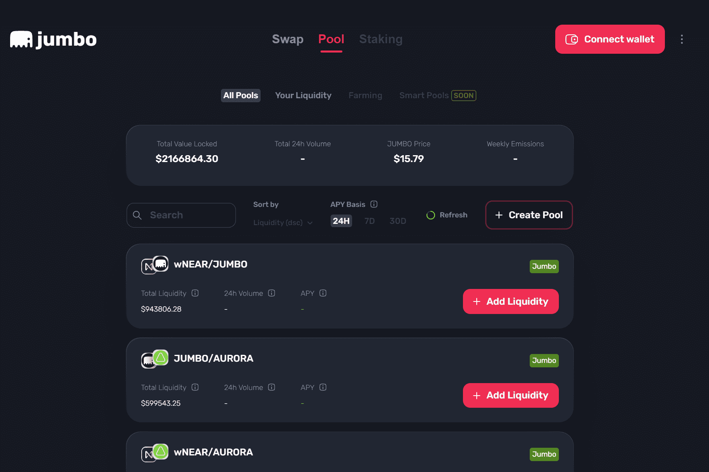

# Jumbo Exchange

从根本上说，Jumbo 是一种 AMM DEX，它为任何人提供了一种廉价、无缝且不受约束的交易方式。按照传统，Jumbo 还允许任何人成为流动性提供者，而无需复杂或伪装任何用户能够这样做的模式。回顾性地考虑某些 DEX 的一些常见设计缺陷，由于 UX 的复杂性不必要地使资产添加和/或流动性提供的方法复杂化，Jumbo 采用了简单明了的自动化操作方式，保持了简单和直接的性质。通过设计，Jumbo 利用 Near 的架构来充分实现 Near 区块链固有的开发、调整和处理的简单性。

