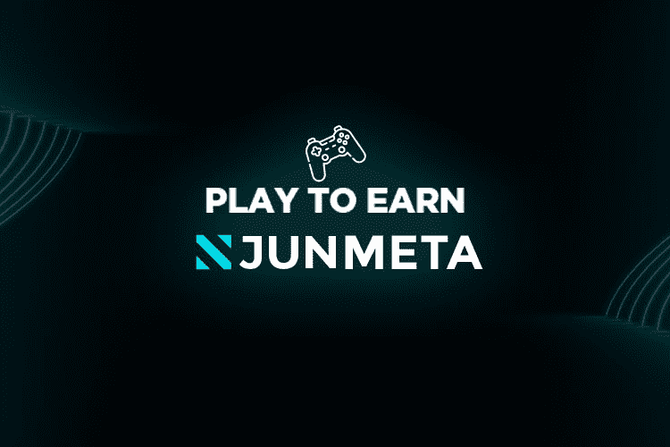

# JUN META

JUN META 的目标是以 NFT 为中心的“Play to Earn(P2E)”和“Burn”。
JUN META 提供两种解决方案
1）容易玩的游戏，从而降低进入门槛。
2）恒定燃烧机制，为算法带来稳定性并优先考虑用户货币化。
JUN Meta的存在只是为了算法的稳定性和用户变现。
我们的目标是成为P2E市场的领跑者。

JUN Meta 的第一个 NFT 是 JOKER NFT，也称为 POT。
JOKER NFT 的铸币由以下类别决定，总共有 100k 变化。
背景·肤色·发色·眼睛颜色·纹身·嘴巴·服装·配饰
每一项的参考值共分为80个，每个10个。

