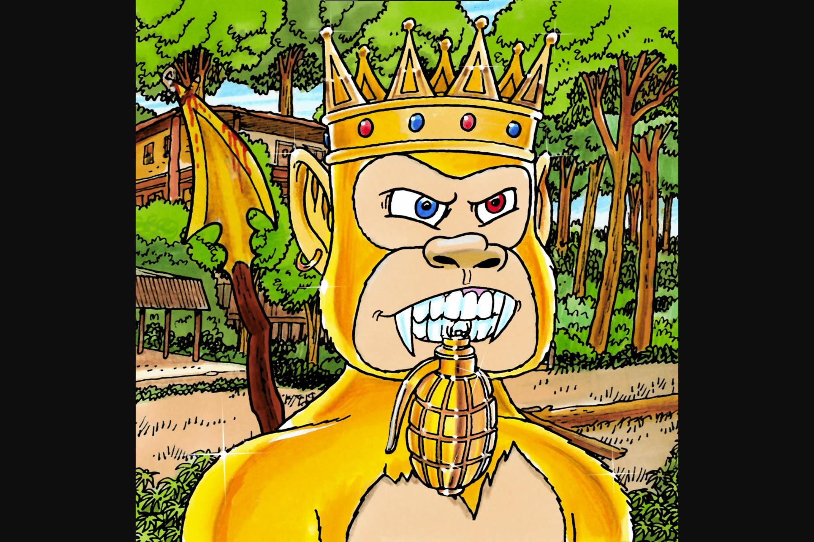

# JUNGLE FREAKS

Jungle Freaks 是传奇的 Hustler Mag 漫画家 George Trosley 的 100% 手绘怪胎系列。这 10,000 个 Freaks 在以太坊区块链上生活和呼吸。
这一年是 2077 年，人类消失了，僵尸已经占领了城市并夺取了大量的军事储备。然而，他们并没有指望大猩猩政权在基因上增强的凶猛和狡猾的特征。大猩猩绿洲要塞受到攻击，但他们永远不会投降。

$JUNGLE 代币是 Jungle Freaks 生态系统的代币。

它是丛林怪人社区中所有事物的生命之血。随着更多实用性和功能的推出，$JUNGLE 代币将成为交易和受益于新功能的中心，为社区创造价值。

对于我们即将推出的系列，$JUNGLE 代币将提供包括 NFT 和折扣在内的独家优惠。

