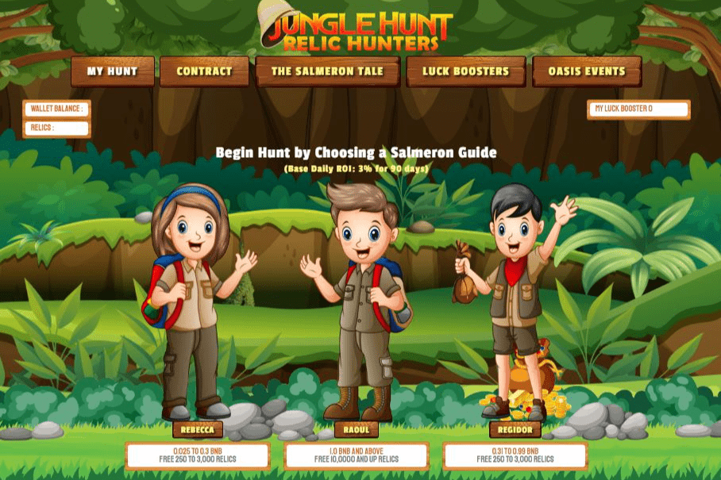

# Jungle Hunt

什么是Jungle Hunt ？

Jungle Hunt 是一款运行在币安智能链网络上的区块链游戏。保证猎人在 90 个月内每天获得 3% 的基本战利品。
可以购买物品来提高寻找遗物的运气，添加更多的遗物代币并增加他们在绿洲活动中的 BNB 份额。上述事件触发系统重新选择五名猎人，他们是与其持有的代币成比例的免费 BNB 的接收者。
加入猎杀鲑鱼并在 90 天内获得珍贵的遗物。

