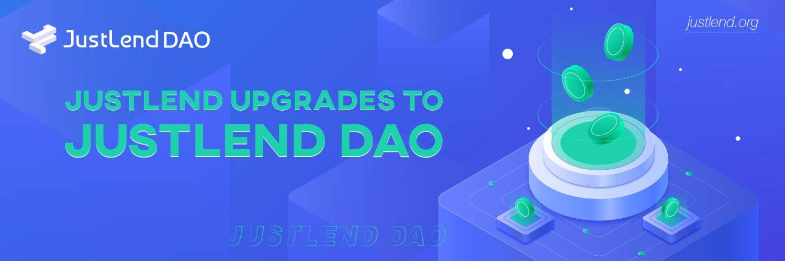

# JustLend

波场第一个官方借贷平台，用户可以借入、出借、存入资产和赚取利息。
JustLend 是一个基于 TRON 的货币市场协议，旨在建立资金池，其利率由基于 TRON 资产供求的算法确定。协议中有两个角色，即存款人和借款人。它们都可以直接与协议交互以赚取或支付浮动利率。
JustLend 现在接受 TRX、USDT、USDJ、SUN、WIN、BTC、JST、ETH 和 WBTT 作为贷款的抵押品。同时，JustLend 允许 TRX、BTC、SUN、JST、WIN、ETH、WBTT、USDT 和 USDJ 的智能合约将与标的资产对应的 jTokens 按汇率分配到用户的账户中。
JustLend 借贷协议和平台为参与者提供不同的激励，例如：
- 对于借款人：卖空资产或借入使用权

- 对于贷方：赚取资产利息
  与传统金融产品相比，无托管人的去中心化协议具有以下优势：

- 基于市场需求的透明和有效定价

- 快速便捷的借贷

- 不受审查和不变性的影响
  JustLend 特点：
  自动订单匹配
  自动匹配供应和借款要求，并产生可观的供应回报。
  丰厚的回报
  随时允许供应和取款。与波场 DeFi 应用程序紧密集成，并承诺立即获得丰厚的回报。
  快速高效的服务
  JustLend 从高性能 TRON 网络中汲取优势，可实现快速且具有成本效益的交易。

  
