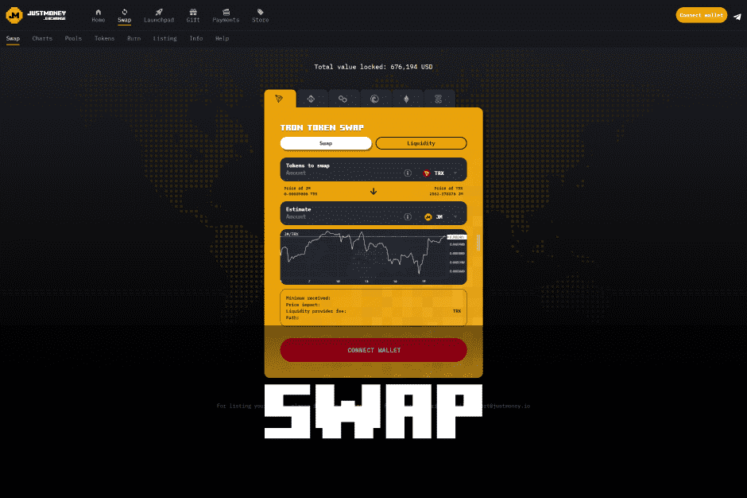

# JustMoney Swap

JustMoney.exchange 是一个去中心化的自动化做市商 (AMM) 交易所。其去中心化金融（DeFi）应用程序允许用户交换代币并为各种加密货币对提供流动性。

Justmoney，为下一代去中心化应用构建生态系统

如何交换：

1. 对于 Tron，您需要安装[TronLink]、[Klever]或其他支持 Tron 的钱包。
   对于 BSC、POLY 和 ZENITH，您可以使用 Metamask 支持的钱包，例如 Metamask 和 TrustWallet。此外，BSC 还支持 Binance Wallet。
2. 点击连接按钮连接你的钱包
3. 选择您要购买的金额和您要支付的货币
4. 如果这是您第一次，它会要求您先批准。点击批准按钮
5. 签署批准书
6. 点击交换按钮
7. 在钱包的弹出窗口中确认交易

