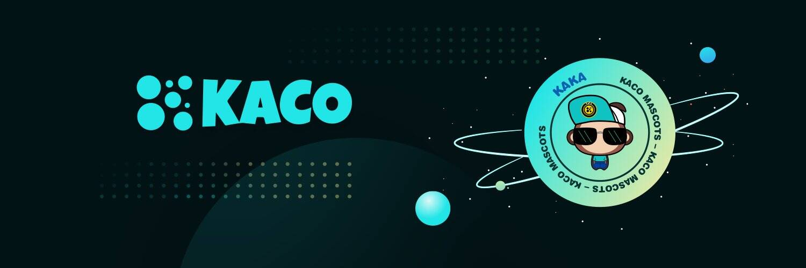

# KACO Finance

Kaco Finance 是 Polkadot 去中心化交易所和合成资产协议 Coinversation 发行的 DEX 的 evm 版本。 Kaco Finance是基于币安智能链和Kusama平行链的跨链去中心化交易平台。 Kaco Finance 最初旨在为 Polkadot 生态项目提供流动性 AMM 和收益农场，并致力于实现 Kusama 和 BSC 之间的资产桥接功能。
  刚刚在区块高度 20485736 完成了前一半。从那个区块高度开始，排放率从每块 0.5 美元 KAC 下降到每块 0.25 美元 KAC。

