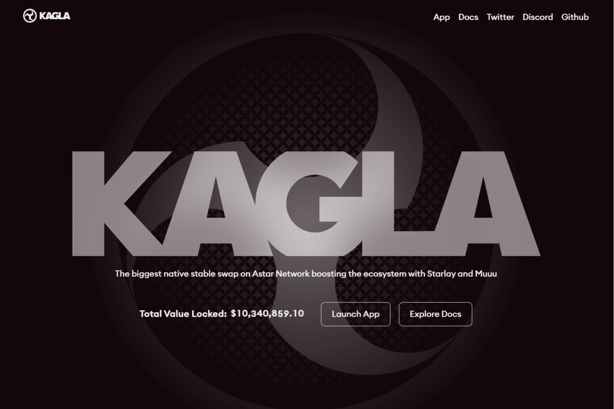

# Kagla Finance

Kagla 是专门用于稳定交换的 AMM，允许流动性提供者赚取费用并借出他们的稳定币来赚取奖励。
使用 ve 函数提高您的奖励。

Kagla Finance 是 Astar Network 上领先的 AMM（自动做市商）和 StableSwap 协议，交易费用低（0.04%）。

“StableSwap”是一个专注于稳定[币的](https://academy.binance.com/en/articles/what-are-stablecoins)[DEX](https://academy.binance.com/en/articles/what-is-a-decentralized-exchange-dex)。通过专注于稳定币，您可以进行低滑点和费用的交易所。

Kagla Finance 不仅实现了低滑点，还将在不久的将来采用“vote-escrow(ve)”来迈向去中心化治理。

可以获取“ve”并让您获得投票权，通过存入您的资产来最大化您的奖励，最高可达 x2.5。

作为旁注，日语“Kagla”意味着在神道仪式中向众神提供的表演。Kagla Finance 的标志基于日本著名的古代家族纹章之一，称为“Mitsudomoe”。

