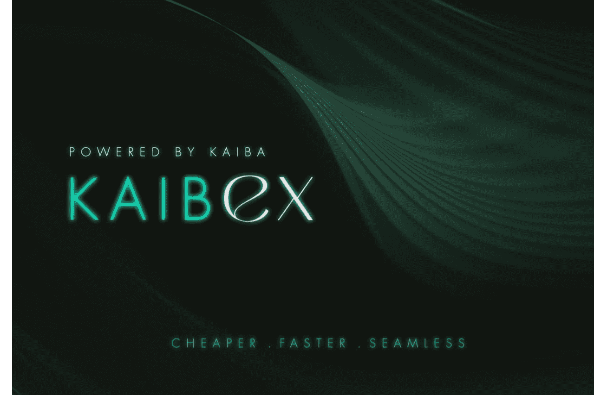

# Kaiba DeFi

Kaiba DeFi 是一个区块链解决方案项目，提供智能合约技术，我们的主要目标是降低以太坊的 gas 费用，以及构建我们自己的闪电区块链。我们的开发团队专注于优化智能合约编码和区块链创新。
当前产品：
我们目前的产品包括 KaibEx 和我们的 P2E 合作伙伴 KleeKai 的第三方后端技术。

  KaibEx 节省 20% 的 gas 费用。它是使用带有集成补丁、修复和增强功能的 UniSwap 的一个分支构建的。除了吹嘘大大节省了汽油费外，它还更快、更高效，并且消除了许多困扰 UniSwap 的错误。
  我们提供的第三方后端技术解决方案采用了与我们即将推出的产品 KaibaSwap（见下文）相同的技术，这是我们技术的一个用例示例，可为用户节省大量汽油费。

2022 年第一季度产品：
未来的产品包括我们自己的区块链和以太坊主网上的革命性 DEX，旨在重塑投资者获取去中心化金融的方式。

  Kaiba 闪电链 (KLC)，基于 Proof of Reputation 共识，具有高达 1000 tx/s 以及许多其他高级功能。有关技术细节的完整概要，请参阅中页。
  KaibaSwap alpha 版本也即将发布，在所有以太坊代币交易中节省了 90%，由内部虚拟链和合成资产提供支持。我们的第 1 层解决方案将彻底改变以太坊上的交易，而无需依赖神话般的以太坊 2.0。

