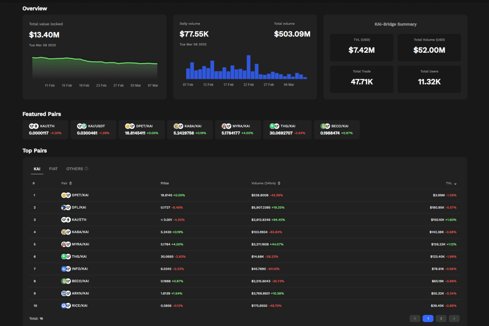

# Kaidex

KAIDEX是去中心化交易所市场首创，具备完全去中心化的跨链代币交易平台能力。 KAIDEX 基于双节点技术，这是一种正在申请专利的新型技术，将真正彻底改变多链交换。使用双节点，用户将能够从任何区块链（什么是区块链技术？是一种高级数据库机制，允许在企业网络中透明地共享信息。 区块链数据库将数据存储在区块中，而数据库则一起链接到一个链条中。 数据在时间上是一致的，因为在没有网络共识的情况下，您不能删除或修改链条。 因此，您可以使用区块链技术创建不可改变的分类账，以便跟踪订单、付款、账户和其他交易。）生态系统中交换代币，而无需与合作伙伴链进行任何集成。 KAIDEX 率先解决劣势，并雄心勃勃地利用 CEX 和 DEX 的优势，做到“两全其美”。

