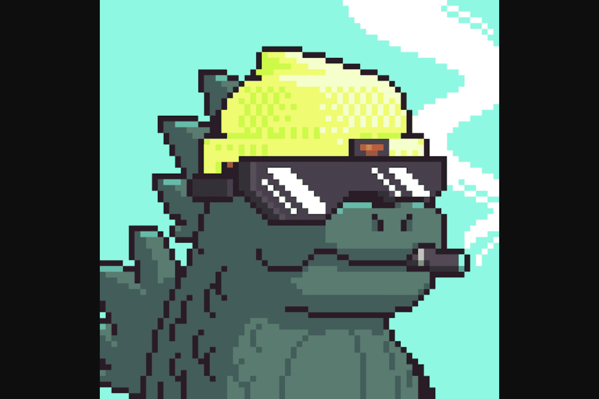

# Kaiju Kingz

KaijuKingz 源于 CyberKongz 持有者和社区成员 OhDots 在他新成立的公司：Augminted Labs 下的思想。 KaijuKingz 希望通过促进 Web3 社区之间竞争和协作的协同机制来扩展其社区。该系列将从铸造 3,333 个 Genesis Kaijuz 开始，每个都授予其持有者在 KaijuKingz DAO 内的投票访问权限。 Kaijuz 被动产生放射性废物，可用于制造 Baby Kaijuz。 Kaijuz 在一个 69x69 像素的正方形中比生命更大，将具有各种各样的特征、类型和不同的美学。持有 Genesis Kaiju 将保留您作为 Metaverse 之王的宝座。

