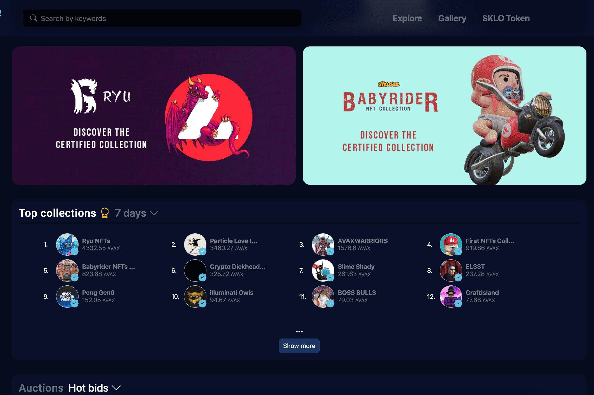

# Kalao

了解卡劳
Kalao 不仅仅是一个 NFT 市场。 Kalao 的愿景是释放元宇宙体验的全部潜力，将 NFT 和虚拟现实技术的成功结合带到现实世界的用例中。这是一个独一无二的价值主张，将使 Kalao 的体验独一无二。
为了实现这一目标，Kalao 正在构建一个一体化 NFT 生态系统，因此提供了一套涵盖大量用例的产品：

  Kalao Marketplace：一个高级市场，用户可以在其中创建、购买、出售和收集他们最喜欢的 NFT
  KalaoGo：允许艺术家、创作者和合作伙伴推出他们的 NFT 收藏。 Kalao 包罗万象，从端到端的角度处理一切。
  Kalao Vision：允许艺术家、创作者、收藏家在他们的个性化 3D 画廊中展示他们收藏中最喜欢的 NFT。与 Kalao Marketplace 完全集成，无需亲自到场即可参观画廊。到达任何地方的任何人。
  Kalao Citadel：跳入完全身临其境的元宇宙体验。 Kalao Citadel 是我们第一个涵盖无限数量用例的社区中心/世界。

