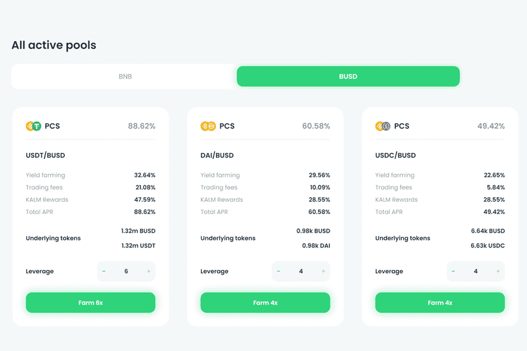

# Kalmar

卡尔玛是币安智能链上的去中心化银行——专注于低交易成本、高交易速度以及通过高度直观的用户界面提供简单直接的用户体验。
通过专注于以太坊上最有效的功能和创新最成功的金融工具，卡尔玛团队正计划过渡这些服务，以满足对币安智能链的相同性质的需求。
这些服务包括（但不限于）借贷、衍生品、支付或流动性提供——同时允许新用户体验高交易速度，同时支付较低的交易费用。
服务的过渡是按照卡尔玛的核心原则完成的：

  基于社区反应的调整
  直观的用户界面
  新手友好的用户体验。

所有迁移的服务都具有互操作性，符合卡尔玛的银行愿景。所有服务还旨在为卡尔玛平台的收入分享机制做出贡献。

