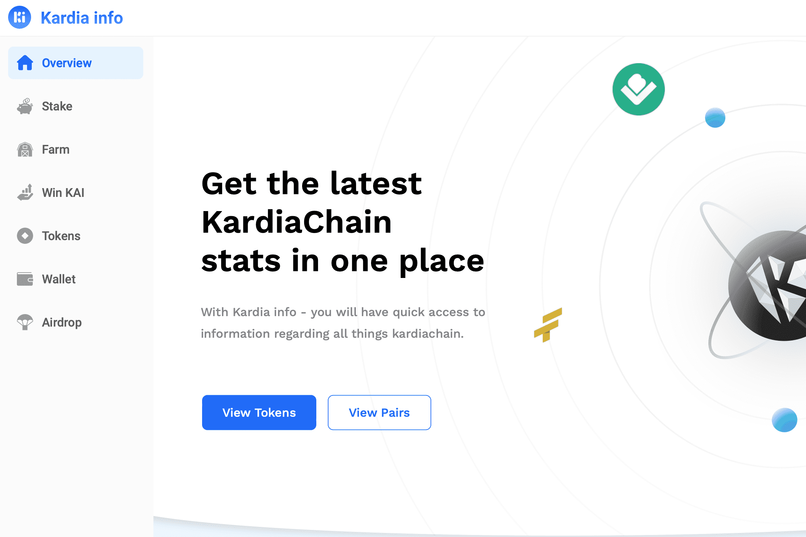

# Kardia info

该网站旨在提供有关 KardiaChain 网络上代币的准确和最新信息，以及预言机、赌注、农业和博彩迷你游戏。

旨在提供有关 KardiaChain 网络和预言机上代币的准确和最新信息的网站。

kardiainfo 的后端服务允许非常快速的加载时间，并且能够通过对智能合约和应用程序的 1 个请求来获取每个 KRC-20 代币的历史价格数据。

信息代币 (INFO) 是 Kardia info 上的原生代币，它是去中心化的、通货紧缩的，并受到其众多用例的支持。它可以被认为是 Chainlink、CMC、Yieldwatch、Poocoin、freebitco.in、cointool 等等的组合。本质上，Kardia info 是一个“一体式”去中心化 kardiachain 工具包，旨在造福生态系统中每个项目的持有者。因此，该代币基本上用于 Kardia info 必须提供的所有区块链功能

