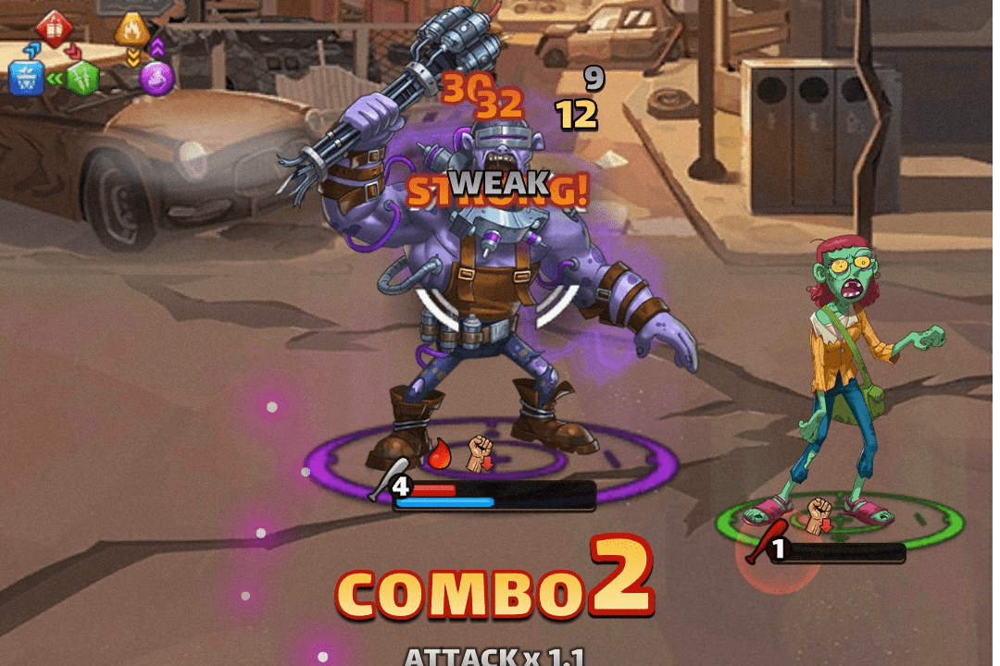

# Karmaverse Zombie

击败僵尸威胁，召集幸存者，建造庇护所，为人类打造新的未来！一款激动人心的全新 NFT 僵尸启示录游戏来了！🛠
业力僵尸
世界上第一个基于区块链的去中心化 SLG，也是 KARMAVERSE 中的第一款游戏。
Karmaverse Zombie 是一款基于区块链的 NFT 社交游戏，专注于在充满僵尸和变种人的后世界末日世界中为生存和统治而奋斗。
在一种旨在几乎消灭人类的病毒传播之后，僵尸和变种人已经遍布地球。幸存的人类已经训练自己成为战士，联合起来在避难所中生存，并努力逐步消除僵尸威胁。
每个玩家将管理一个庇护所，他们控制的每个战士都由一个独特的 NFT 代表，玩家可以在游戏中出售、交易和使用这些 NFT。通过组建强大的格斗团队，玩家将能够创建这片土地上最强大的搏击俱乐部来抵抗僵尸部落，并与其他玩家一起工作或竞争。
目标听众
该项目基于成熟的手机游戏玩法和技术，意味着进入门槛相对较低，无需成为区块链大师或 Steam 上的成就猎人即可享受我们的游戏。许多玩家将分为几类：

  享受休闲游戏、纸牌游戏以及具有竞争模式和排行榜的游戏。
  厌倦了游戏很难或不可能从游戏资产中获得真正的回报。
  不喜欢开发人员完全控制资产并且能够在没有玩家输入或追索权的情况下更改任何内容。
  感觉他们还没有机会发挥自己的潜力。
  想通过做一些他们喜欢的休闲事情来赚钱和回报。

