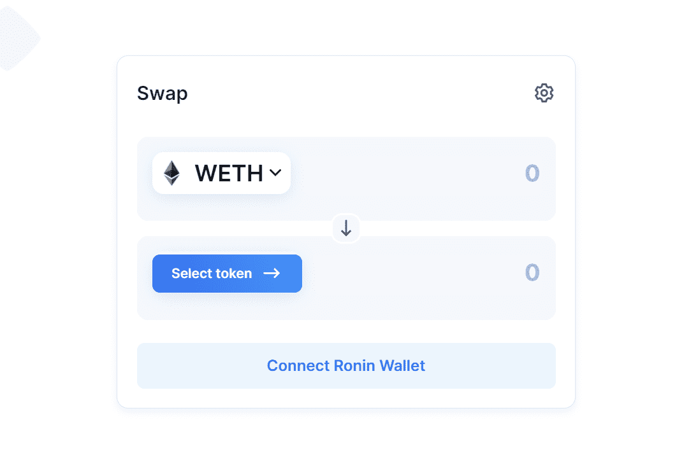

# Katana

主要特征

  交换：Katana 允许任何人在各种 ERC 20 资产之间轻松交换。
  矿池：用户可以向 DEX 提供流动性并赚取掉期费。
  农场：用户可以质押他们的流动性池代币来赚取 RON。
流动资金池是锁定在智能合约中的资金池。 任何用户（称为流动性提供者）都可以将资金添加到池中以使其更具流动性。
提供流动性时，您将向池中提供等值的 2 个代币。 例如，如果 ETH 的当前价值为 4,000.00 美元，而 AXS 的价值为 100.00 美元，并且您想向 ETH-AXS 池中提供 1 ETH，则您还需要提供 40 AXS 作为配对。
流动性提供者将相等价值的两个代币添加到池中以使其更具流动性。
作为回报，流动性提供者将从池中发生的掉期中赚取与其池份额成正比的交易费用

