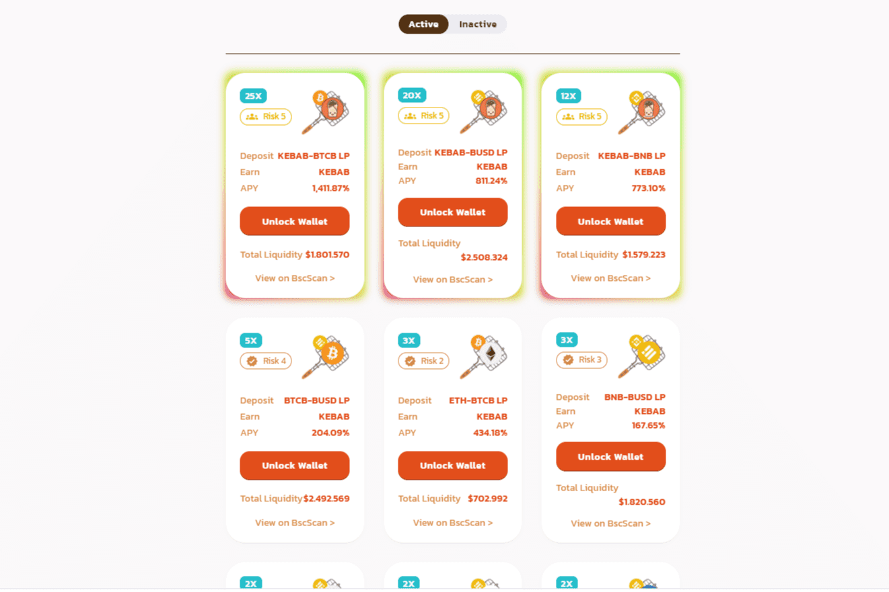

# Kebab Finance

今天的 Kebab 代币价格为 10.43 美元，24 小时交易量为 2.600.631 美元。 Kebab 代币在过去 24 小时内下跌了 5.37%。当前 CoinMarketCap 排名为 #840，市值为 7.492.020 美元。它有 718.415 枚 KEBAB 代币的循环供应量和最大数量。供应不可用。
仅适用于币安智能链的高级算法收益农场。

我们很高兴地宣布与 Astronaut.to (Naut) 建立战略合作伙伴关系，这是一种混合汽车收益代币和协议，用于分散新项目和想法筹集资金的方式。通过这一令人兴奋的合作伙伴关系，Nauts 和 Kebabians 将访问具有新功能的更广泛的 DeFi 生态系统。

Astronaut.to 在其他知名 DeFi 项目中享有盛誉，具有创新功能和强大的社区。该协议旨在分散进入 BNB 生态系统的新项目和想法如何通过建立基于代币固定购买率的交换池来筹集资金。

与传统 ICO 和 IDO 的筹款模式相比，Astronaut “固定交换池”通过在整个销售过程中保持代币价格直到购买初始供应，为代币销售投资者提供了许多优势。

‌借助 Astronaut，去中心化项目将能够方便地筹集和交换资金。用户可以在币安智能链上参与一个安全且可互操作的环境。

我们的战略合作伙伴关系将利用 Binance Smart Chain 的力量，为利用 DeFi 的财务自由和机会奠定基础。

