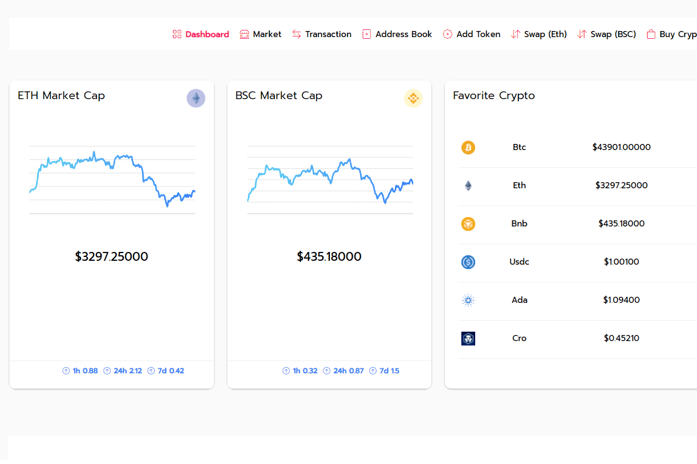

# KeeCoin

KeeCoin Token 的创建者成员开发了完全去中心化的 DAPP，用于自动创建和管理投资组合。通过创新的 Armony Dashboard，可以直接以绝对去中心化的方式管理您的钱包，无需任何中介。由于 KeeSwap 的开发，可以在 ERC20/BEP20 上管理您的帐户、列出交易、地址簿、购买/出售加密货币和交换代币。Keecoin 是一种基于去中心化币安区块链的代币，它使用点对点技术，无需任何当局或银行的集中控制即可运行。Keecoin 代币是公开的，可以在 BscScan 上查看或在 Pancakeswap 上购买。

