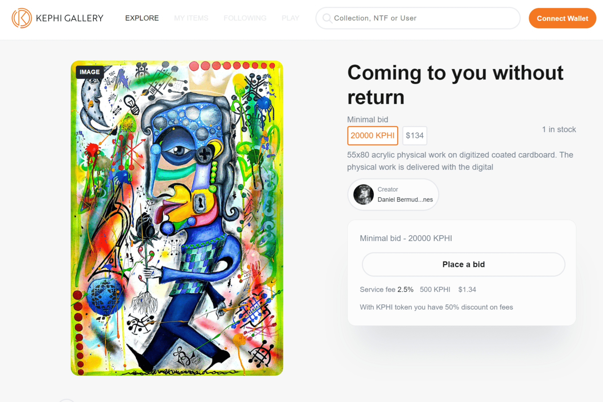

# Kephi Gallery

Kephi Gallery 是一个跨链、低费用的 NFT 市场，来自不同学科的艺术家可以在这里聚集并分享（并获利！）他们的作品。从视觉艺术到音乐，从电影剪辑到戏剧，欢迎每位艺术家铸造他们的 NFT 并开始交易他们的艺术品。 Kephi 代币 (KPHI) 是 Kephi Gallery 自己的实用代币。 KPHI 将可供使用该平台买卖 NFT 的人进行挖矿。除此之外，Kephi 将有一个广泛的忠诚度计划，其中 KPHI 将用于获得以下好处： 费用折扣 NFT 空投 特殊的个人资料框架（使您的艺术品脱颖而出） 出现在 KEPHI 自己的收藏中……等等！

