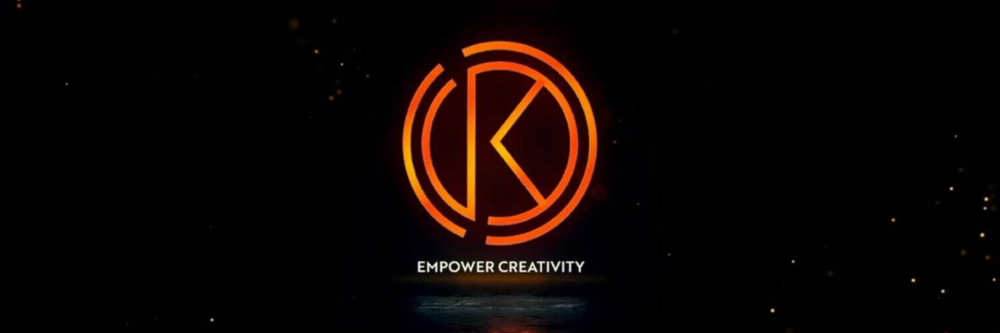

# Kephi Play

Kephi Play 是一种游戏，玩家获得一个随机数，并且必须下注下一个随机数是否会高于或低于给定的随机数。如果他们是正确的，他们将他们的赌注（KAI 或 KPHI）乘以他们之前选择的金额（从 x1.01 → x4750 的任意位置）。顶玩并获胜。与 KPHI 一起玩·与 KAI 一起玩……让它独一无二，并在有人购买时开始获利。将所有“技术资料”留给 Kephi！

如何购买 KPHI 代币
您可以轻松购买它们：PancakeSwap 或 Kaidex
Kardiachain 代币：0x6CD689DefCA80f9F2CBED9D0C6f3B2Cf4abc4598
BSC 令牌：0xfa4a5c4ce029fd6872400545df44675219c2e037
规则
2022 年 8 月 8 日，Kephi 将开始其第一轮质押。

本轮有一些规则，所以请注意详细规则和参数：

Staking 合约将部署在 Kardiachain 区块链上
用户可以存入至少 1 KPHI 的任意数量的代币
用户可以在 2022 年 8 月 8 日之后的任何时间存入 KPHI，直到质押计划结束
质押期：灵活。您可以随时质押和取消质押
用户可以多次存入KPHI
用户可以随时提取存入的KPHI
存入 KPHI 后，用户将获得 sKPHI 作为奖励。该奖励可以随时用KPHI代币兑换
有关赚取规则，请查看赚取。下面的部分
年利率：
用户的 APR 不是静态的，取决于矿池份额、KPHI 数量和代币价格。您可以在灵活的期限内质押您的代币，APR 会根据质押代币的数量增加/减少。

由于参与者数量较少，首先质押的用户将获得最大收益，因此获得更大的矿池份额。

