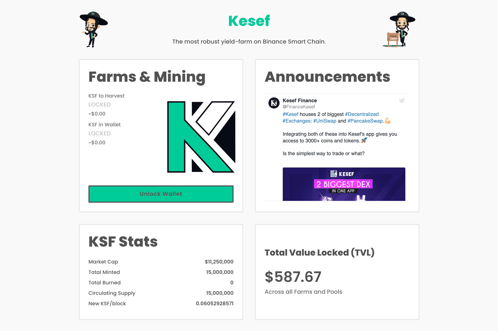

# Kesef Finance

DeFi 生态系统主要基于 Yield Farming 并提供流动性。但是，如果这个空间必须发展并成为现实世界问题的解决方案，那么 DeFi 的定义也应该发展。这正是 Kesef 的全部意义所在。
我们正在弥合现实世界的金融问题和加密货币之间的差距，采用应用优先的概念来处理您的所有财务需求。无论是法定货币还是加密货币，您都可以使用 Kesef Finance。
我们提供的产品可能看起来像一个简单的钱包，但它几乎可以满足您所有的财务需求——不仅仅是加密。使用虚拟和物理借记卡，您可以使用您的加密货币而无需出售它们，在您的银行获得法定货币，然后使用它。此外，您可以获得对加密货币的最高可用利息，并以精心策划且简单的方式交易所有 3000 多种代币。

