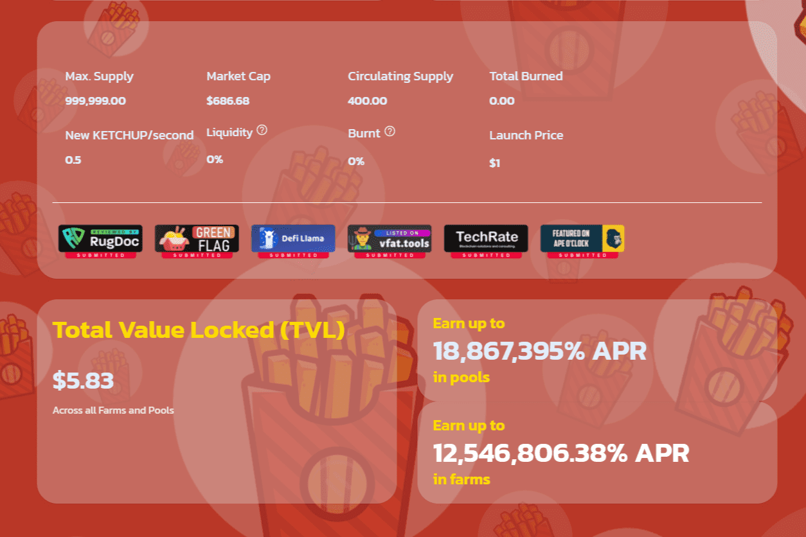

# Ketchup.Finance

社区驱动 整个 Ketchup.Finance 生态系统是一个社区驱动的项目。大多数关于功能、新矿池、新农场、代币列表和更新的决定将由社区提出和投票。通过在 Ketchup.Finance 上进行 Yield 农业，Yield 农民将他们的加密货币投入使用并赚取高额利息

KetchupFinance 是一个自动化做市商 (AMM) — 一种去中心化金融 (DeFi) 应用程序，允许用户交换代币，通过农业提供流动性并赚取费用作为回报。

这是一个去中心化的交易所，用于在币安智能链上交换 BEP20 代币。 KetchupFinance 使用自动做市商模型，用户在流动资金池中进行交易。这些池由将资金存入池中并获得流动性提供者 (LP) 代币作为回报的用户填充。

这些代币以后可以用来收回他们在池中的份额，以及部分交易费用。 KetchupFinance 允许用户交易 BEP20 代币，为交易所提供流动性并赚取费用，质押 LP 代币以赚取 KETCHUP，质押 KETCHUP 以赚取更多 KETCHUP，质押 KETCHUP 以赚取其他项目的代币。

KetchupFinance 使用推荐计划。使用推荐链接，您可以永久获得 1% 的奖励。 KetchupFinance 还使用自动流动性和销毁系统。在每次转账中，有 4% 用于 LP BNB 以避免价格影响，1% 用于销毁。

