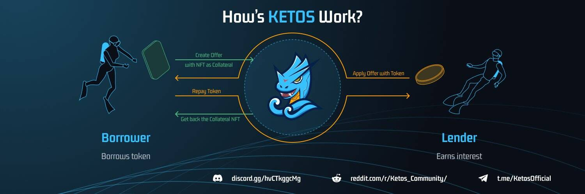

# Ketos

Ketos 协议是一个 P2P 去中心化 NFT 典当平台。 Ketos 允许借出由 NFT 担保的硬币和代币。我们支持贷款人和借款人相互联系。

为什么需要 KETOS？
无需出售 NFT 即可轻松赚钱。
由于 NFT 是不可替代的，一旦你放弃了 NFT，就不容易回购它。
NFT 可能会为其所有者带来超过其在市场上交易的货币价值。因此，对于 NFT 持有者来说，拥有是很重要的。
使用 Ketos，您可以在不放弃拥有 NFT 的情况下获得资金。

