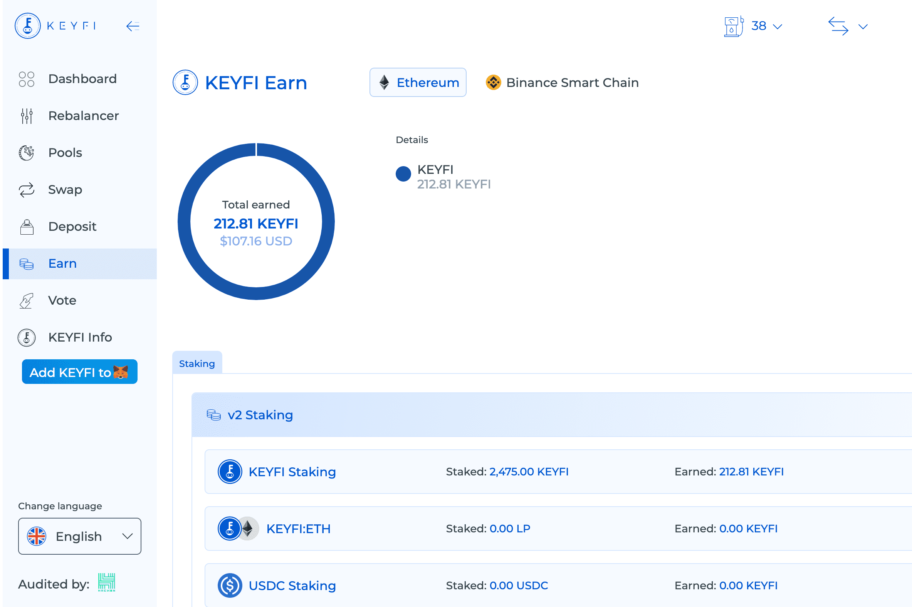

# KeyFi

KeyFi 是一个一体化的 DeFi 平台，提供智能工具来跟踪和管理您的 DeFi 投资组合。功能包括自定义策略构建器、收益预测、投资组合跟踪和强大的研究仪表板。

我们寻求解决 DeFi 用户面临的挑战，例如处理多个钱包/平台/链、手动比较收益率以及缺乏历史数据。跨多个链（接下来是 ETH、BSC 和 Polygon）以及跨多个平台（例如 Compound、Aave、1inch 等）管理多个资产，所有这些都来自一个方便的应用程序。

