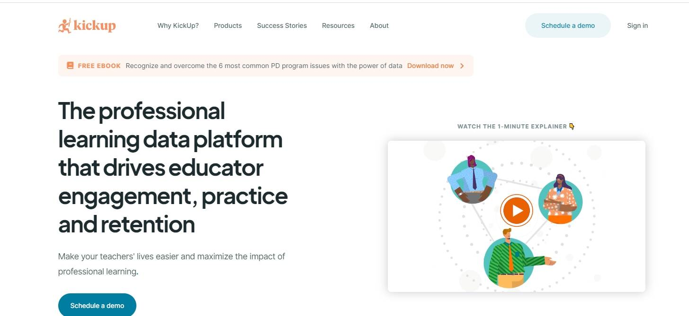

# Kick Up!

推动教育者参与、实践和保留的专业学习数据平台通过将来自学习步行、辅导周期和需求评估的数据整合到一个中心，改善教育工作者的实践并获得有关支持有效性的见解。通过将所有在线和离线 PD 连接到一个简单的事实来源，建立教育工作者的参与度和有效性。*KickUp*帮助 K-12 学校、学区和服务机构为教师提供量身定制的专业支持，并捕捉专业...帮助 K-12 系统管理教师专业学习、评估项目影响并使用形成性数据来推动更好的决策。

