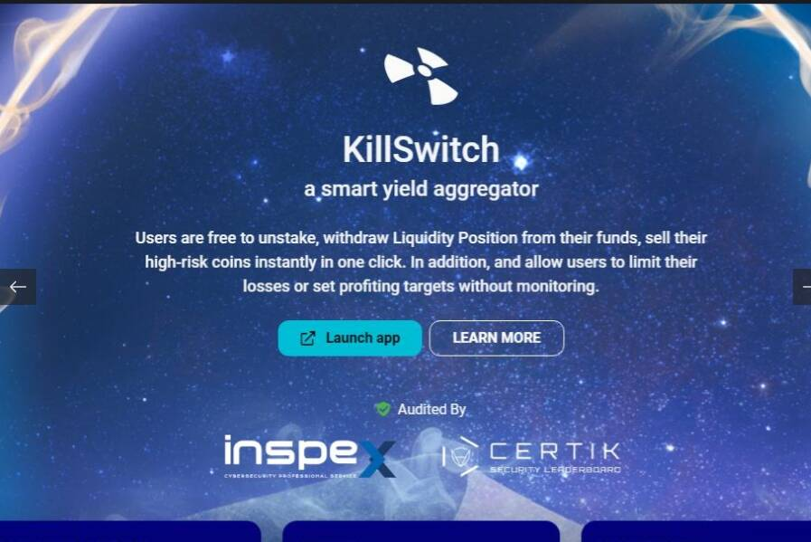

# KillSwitch V.2

KillSwitch V.2 是一款智能单产农业聚合器，可消除农业缺陷，为所有农民增加便利性和安全性。这些功能现已在 Binance Smart Chain 和 Polygon chain 上提供，具有 3 个突出功能；
1。 一键质押 一键质押程序，通过简单的步骤最大限度地减少时间浪费，只需选择池和数量，然后点击“质押”。这一切都将在一次交易中发生。
2。 仓位（撤回）- 用户可以随时终止仓位，使用任何他们想要的代币
3。自动复合 所有耕种的代币将每 24 小时自动转换添加到用户的仓位或将由“银河护卫队”自动再投资（任何在 KillSwitch 中耕种的人都可以点击复合给大家）。这确保所有收益都被再投资，以进一步最大化用户的利润。银河护卫队获得全部奖励的 1.2%。即将推出

4.  - 将 LP 代币交换为用户可以在池源中质押的其他 LP 代币。对于那些喜欢从一个平台跳到另一个平台的人来说，此功能非常有用。
5.止盈/止损- 用户可以设置在给定条件下关闭自己的投资或同样获得一定数量的利润。
我们的成功取决于您的满意度以及您对与我们一起耕作的感受。

