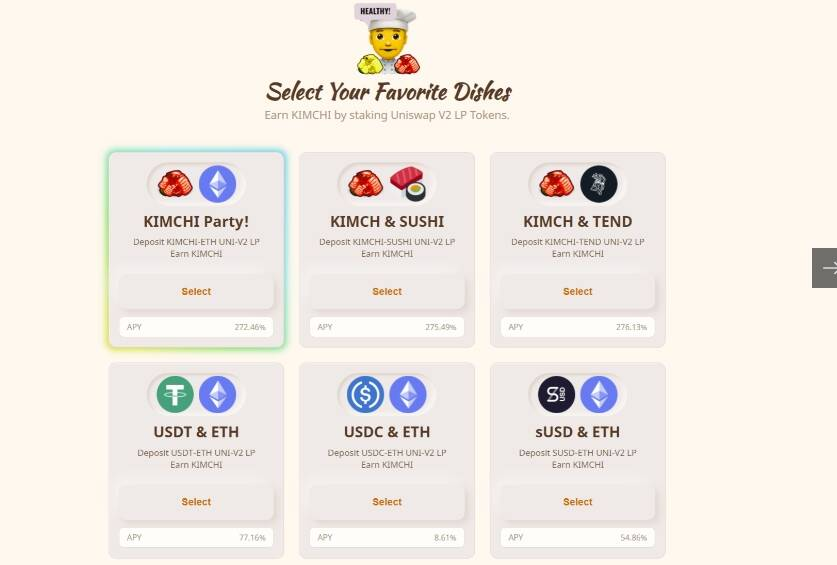

# Kimchi Finance

质押 Uniswap LP 代币以获取 KIMCHI 和 gKIMCHI！有传言说 KIMCHI 可以由部署者铸造。简而言之，这是不可能的。铸币功能由“KIMCHI CHEF”合约用以提供奖励。而“KIMCHI CHEF”合约的所有者是“时间锁定”合约。除此之外，“时间锁定”合约的所有者是“KIMCHI”代币合约，而“KIMCHI”代币合约的所有者是“KIMCHI CHEF”合约。所以？没有人可以控制泡菜。 KIMCHI 永远存在。您可以通过检查合同轻松检查上述声明。*Finance*（KIMCHI）是一种加密货币，在以太坊平台上运行。泡菜

