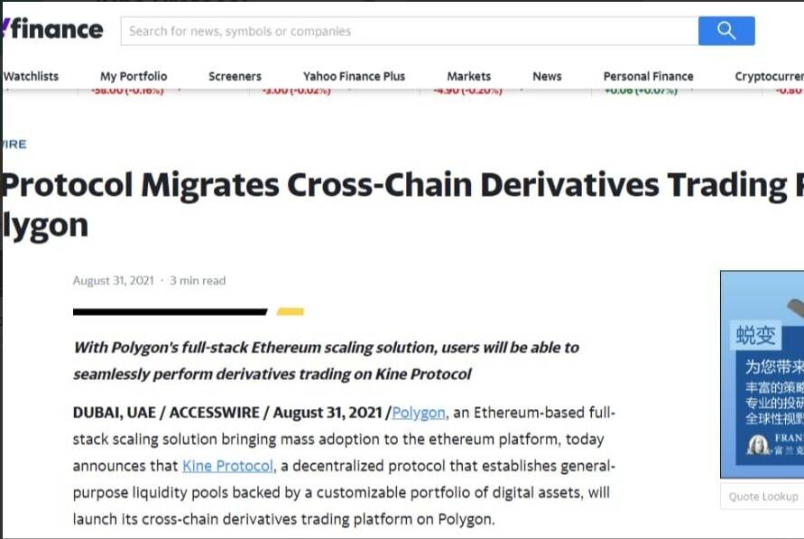

# Kine Protocol

Kine是一个去中心化交易所，链上Staking，衍生品交易0gas费，0滑点。点对池模型为交易者提供了一个不受流动性或基础限制的市场。 Kine 建立在 ETH 之上，现在支持 BSC 和 Polygon 作为多链平台。一个强大的去中心化交易所在你的口袋里。安全、快速、轻松地购买、出售和交易加密货币。查看实时加密货币价格。2021 年 12 月 6 日— *KINE 协议*是一个基于以太坊的去中心化衍生品协议，旨在建立一个无限流动的衍生品市场并帮助...

