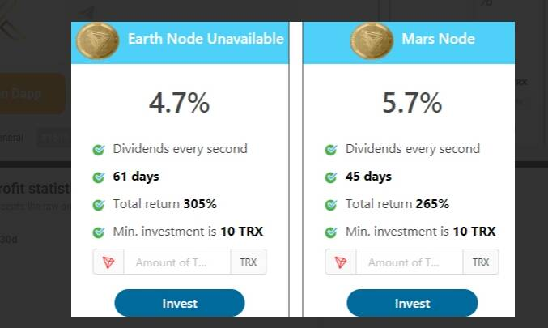

# King Of Profit

2022 年第二季度，游戏公司*King*（也称为King.com 和*King* Digital Entertainment）创造了 2.71 亿美元的收入。Kinf Of Profit 智能合约项目开工日期：2020/09/10📃项目描述：该项目有45%实物保险等选项;项目计划👇第一个计划：日利润4.7%计划时长：61天总利润：305%最低投资：10个宝座方案二：日利润5.7%计划时长：45天总利润：265%最低投资：10个宝座第三个计划：每天6.7%的利润计划时长：28天总利润：188%最低投资：10个宝座第四方案：7.7%的日利润计划时长：21天总利润：162%最低投资：10个宝座订阅奖励：第一级：5%二级：2%第三级：0.5%

