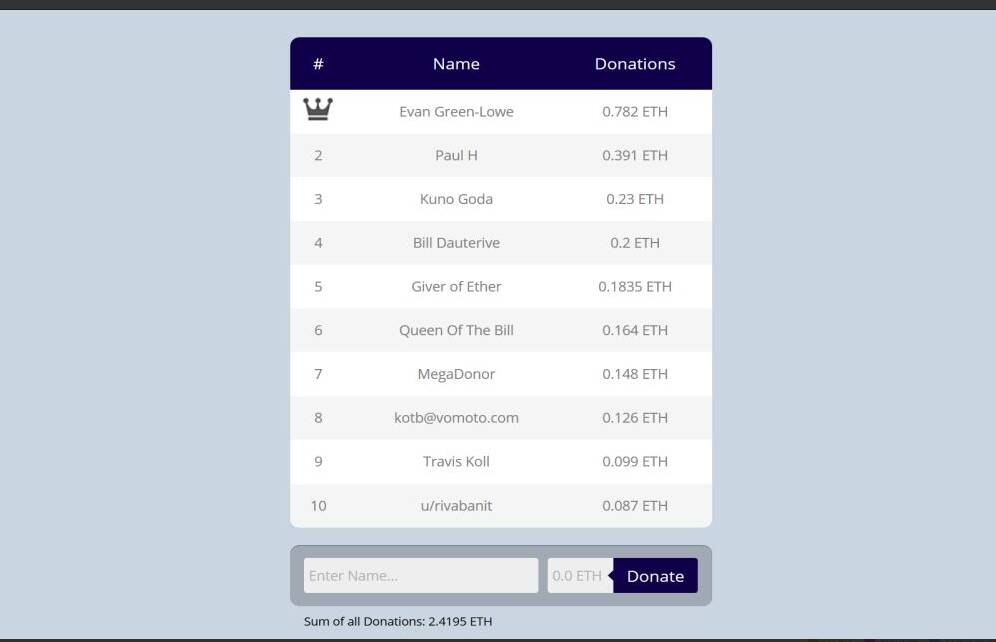

# King of the Bill

“King of the Bill”是一个将捐款转发给慈善机构的 Dapp，并保留了谁捐款最多的排行榜。底层智能合约自动将捐款转发给 GiveDirectly。 GiveDirectly 通过与手机相关的支付服务为肯尼亚、乌干达和卢旺达的家庭提供收入。它针对的是极低收入的家庭。情节概述。在生病期间照顾山丘后受到鼓舞，*比尔*在中途之家做志愿者，但很快就开始...*King* & Spalding ... 只需简单多数即可通过该*法案*；哈里斯副总统投了决胜票。美国的气候*法案*以及欧洲的一项平行倡议可能会重塑全球能源。Plug Power、Sunrun 等公司.

