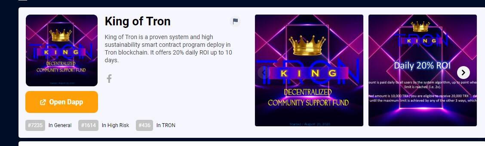

# King of Tron

KingOfTron 智能合约旨在为每个人提供基于区块链和智能合约技术的独立财务基础。通过将 TRX 存入基金（合约地址），您将激活程序并将收到 200% 的返还，并根据合约算法进行分配。KingOfTron 是 100% 去中心化和基于社区的；系统没有额外的利润，它是一种P2P支持模式，确保所有人的公平、透明和公正。中介或中间人，没有所有者，没有公司或人的互动，根据智能合约的规则有效地保证了所有参与合作伙伴的公平性。是目前最合理、最安全、最前沿的金融支持模式。

