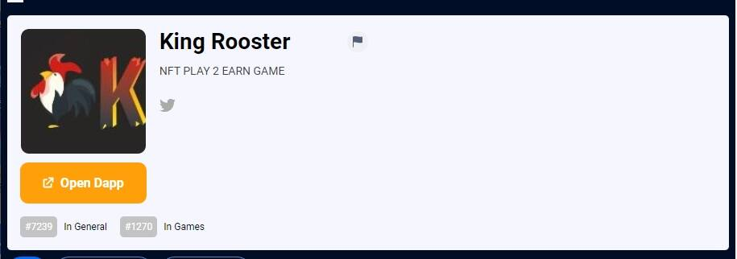

# King Rooster

King Rooster 是第一个基于区块链的“PLAY TO WIN”（P2E）斗鸡 NFT 游戏，玩家可以在其中饲养、照顾、喂养、训练和繁殖他们的公鸡。该游戏旨在让我们的玩家逐渐成长，产生一个有竞争力的内部市场，允许我们所有玩家以完全独立的方式进行互动，并且对产生的每笔交易不收费（仅在提款交易中）。在 King Rooster 提出的选项中，拥有“戒指”最为突出，它的收入是被动的，取决于在其中进行的事件和投注的数量。这些戒指是 NFT 资产，玩家可以获得这些资产以在 King Rooster 的世界中分散他们的投资。

