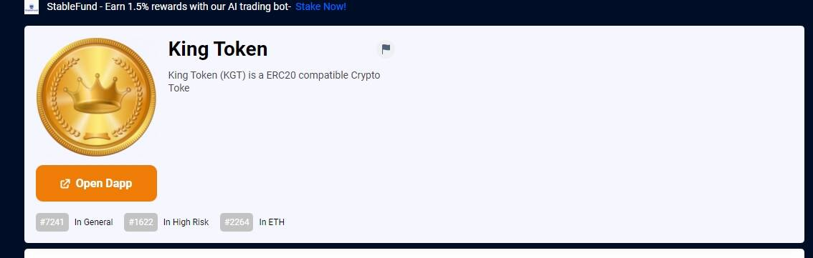

# King Token

*使用历史KING* USD 图表、流动性和交易量实时跟踪当前 CryptoBlades Kingdoms 价格PooCoin 为 Binance Smart Chain (BSC) 代币实时流媒体图表 DAPP。... CryptoBlades *KING 令牌*(KING/BUSD)。0.00211624 美元。输入令牌名称/地址King Token (KGT) 是托管在以太坊区块链上的兼容 ERC20 的加密代币。它是第一个通货紧缩和可开采的代币，拥有自己的中央金融管理局（KCMA），积极校准通货紧缩（燃烧）率和通货膨胀（采矿）率，以规范代币供应并为所有人创造财富生成效应国王令牌持有者。King Token (KGT) 是一种兼容 ERC20 的 Crypto Toke

